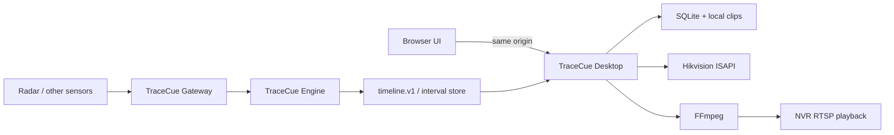

# Architecture overview

[中文](overview_CN.md)

## Runtime topology

Desktop serves the SPA and HTTP API from one local process. It runs on demand and binds to loopback by default. Gateway is an always-on producer only for deployments that require historical sensor intervals. Engine is a vendor-neutral library embedded into a producer or import path.

## Responsibility boundaries

### Desktop

- NVR credential references, capability reports and channels.
- Search/bookmark API and timeline import/mapping.
- Recording coverage resolution.
- FFmpeg job lifecycle, clip retention and browser delivery.
- Honest source/quality labels in the UI.

### Gateway

- Continuous acquisition while desktop is closed.
- Source clock observation and health.
- Device/model adapters and bounded diagnostic buffering.
- Engine execution and durable interval delivery.
- No NVR video archive responsibility.

### Engine

- Interval and source-channel types.
- Validation, deterministic IDs, merge/filter and quality-gate primitives.
- `media_window` calculation.
- `timeline.v1` serialization/validation.
- No UI, NVR, FFmpeg, OS credential or Home Assistant dependency.

## Media flow

1. A bookmark identifies a source interval and resolved space.
2. Space mapping selects one or more NVR channels.
3. Desktop searches recording coverage for the requested media window.
4. The resolver returns actual covered and missing spans plus one or more playback locators.
5. FFmpeg first attempts H.264 stream copy; incompatible video/audio follows an explicit transcode policy.
6. Output is written to `.partial`, verified and atomically renamed.
7. Browser retrieves the clip with HTTP Range support.

## Time model

Internal persistence uses UTC epoch milliseconds. External contracts use RFC 3339 with explicit offsets. Every device probe records device time, host time, observation time, timezone and estimated clock skew. Mapping a sensor interval to NVR media must make skew correction observable.

## Failure philosophy

Partial success is explicit: recording gaps, unsupported capabilities, failed quality gates, stale timelines and unmapped channels are states, not empty success results. Hardware behavior is reported per model/firmware evidence.
