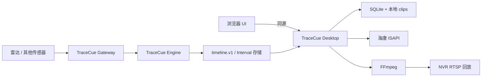

# 架构总览

[English](overview.md)

## 运行拓扑

Desktop 在同一本地进程中提供 SPA 和 HTTP API，默认监听回环地址。常驻融合回查服务在界面关闭后仍保存雷达历史和本地抓拍（[ADR-0008](decisions/0008-local-clip-review_CN.md)）。NVR RTSP 回放仍是可选冷存档。

## 职责边界

### Desktop

- NVR 凭据引用、能力报告和通道；
- 检索/书签 API，以及 timeline 导入/映射；
- 解析录像覆盖；
- FFmpeg 作业生命周期、clip 保留和浏览器交付；
- UI 中诚实展示来源和质量标签。

### Gateway

- Desktop 关闭时仍持续采集；
- 来源时钟观测和健康状态；
- 设备/型号适配器和有界诊断缓冲；
- 执行 Engine 并持久交付 Interval；
- 不负责保存 NVR 视频。

### Engine

- Interval 和来源通道类型；
- 校验、确定性 ID、合并/过滤和质量门控基础能力；
- 计算 `media_window`；
- `timeline.v1` 序列化/校验；
- 不依赖 UI、NVR、FFmpeg、操作系统凭据或 Home Assistant。

## 媒体流程

1. 书签标识来源 Interval 和已解析空间；
2. 空间映射选择一个或多个 NVR 通道；
3. Desktop 查询请求媒体窗口的录像覆盖；
4. Resolver 返回实际覆盖、缺口和一个或多个回放定位符；
5. FFmpeg 先尝试 H.264 直接封装；不兼容视频/音频按明确策略转码；
6. 输出先写 `.partial`，校验后原子改名；
7. 浏览器通过 HTTP Range 读取 clip。

## 时间模型

内部持久化使用 UTC epoch 毫秒；外部契约使用带明确时区的 RFC 3339。每次设备探测记录设备时间、主机时间、观测时间、时区和估算时钟偏差。传感器 Interval 映射 NVR 媒体时，偏差校正必须可见。

## 失败原则

部分成功必须显式表达：录像缺口、不支持能力、质量门控失败、timeline 过期和通道未映射都是状态，而不是空的成功结果。硬件行为按型号/固件证据报告。
